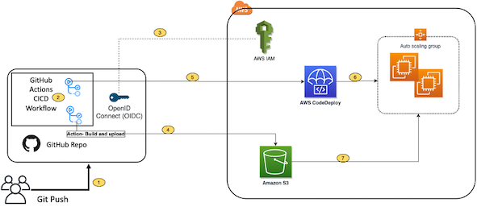

* [Document_Link](https://aws.amazon.com/blogs/devops/integrating-with-github-actions-ci-cd-pipeline-to-deploy-a-web-app-to-amazon-ec2/)

## Solution Overview

1. Developer commits code changes from their local repo to the GitHub repository. In this post, the GitHub action is
   triggered manually, but this can be automated. GitHub action triggers the build stage.
2. GitHub’s Open ID Connector (OIDC) uses the tokens to authenticate to AWS and access resources.
3. GitHub action uploads the deployment artifacts to Amazon S3.
4. GitHub action invokes CodeDeploy.
5. CodeDeploy triggers the deployment to Amazon EC2 instances in an Autoscaling group.
6. CodeDeploy downloads the artifacts from Amazon S3 and deploys to Amazon EC2 instances.

