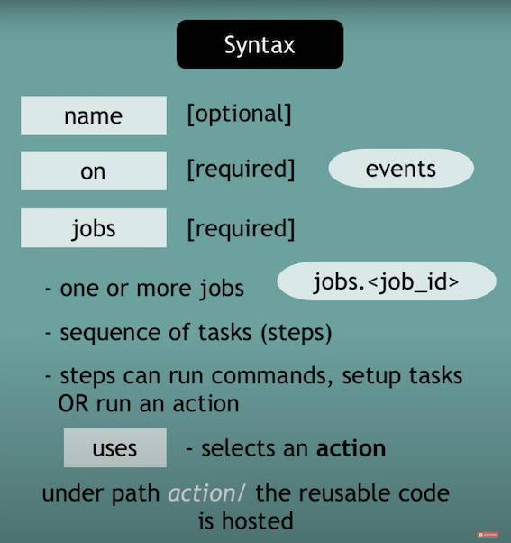

# GitHub actions

* Platform to automate developers workflows.
* CI/CD is one of the workflows.

## What are those workflows?

- when something happens in or to your repository
    - These are events -> PR created, Contr. joined, PR merged, Issue created.
- automatic action are executed in response
- 1- Listen to event 2- Trigger a workflow
- workflow is combination of action -> each step of workflow is an action.

## CI/CD with GitHub actions.

### why another CI/CD tool?

* use same tool instead of third party integration
* set up the pipeline is easy.
    * Integration with other tools is simple is like declarative way.
* tool for developers

### Syntax

- uses for actions
- run for commands

### where does this code run?

* managed by GitHub (but you can host your own.)
* each job in a workflow runs in a fresh virtual environment
* by default jobs in workflows run in parallel, but you can use needs to define requirement for it.